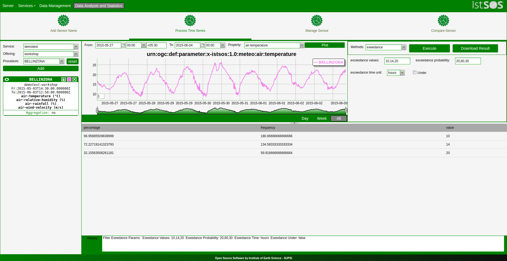
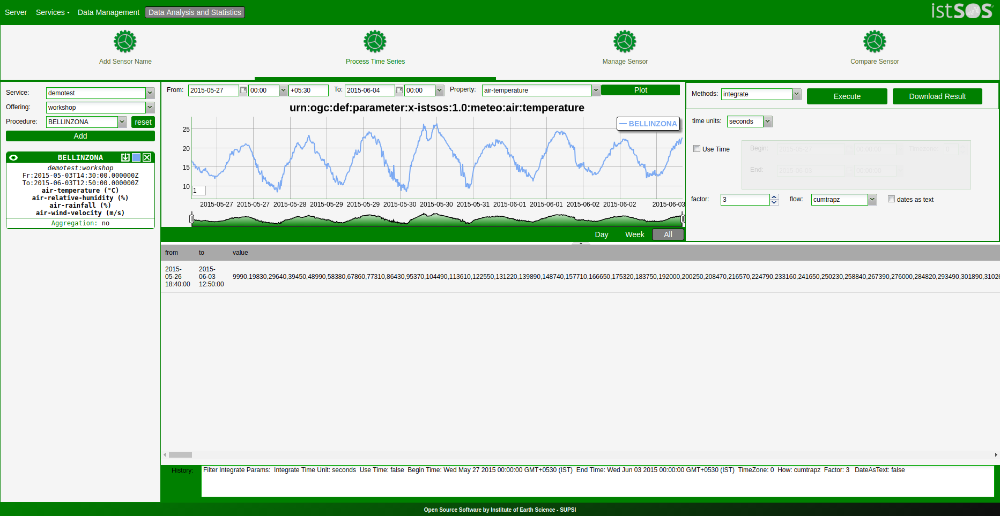
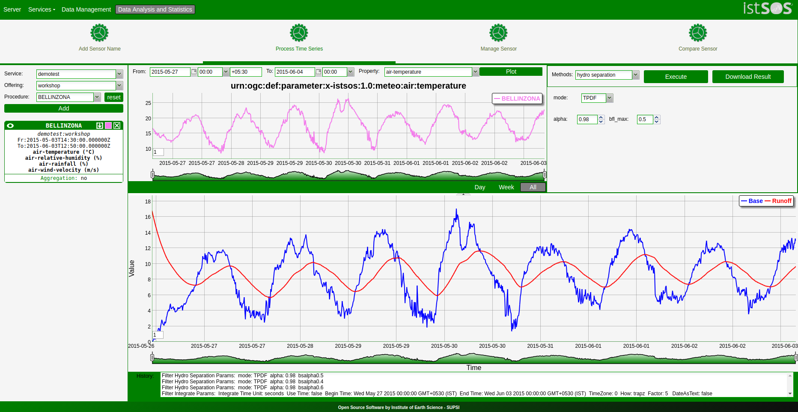
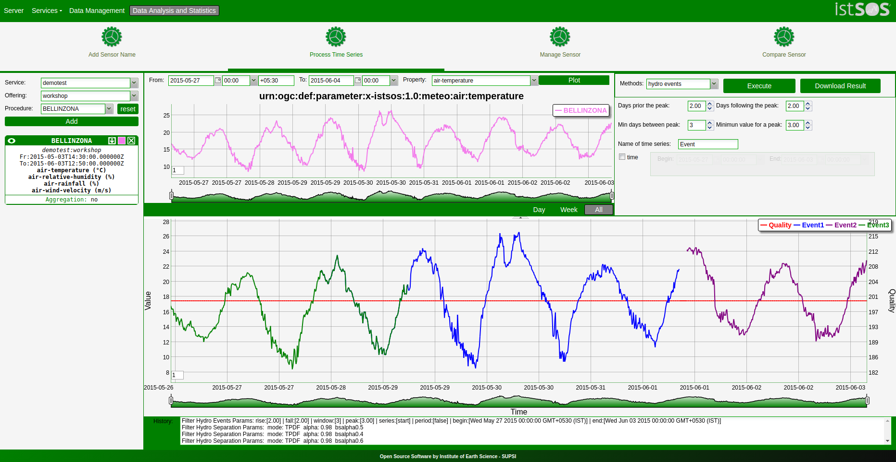
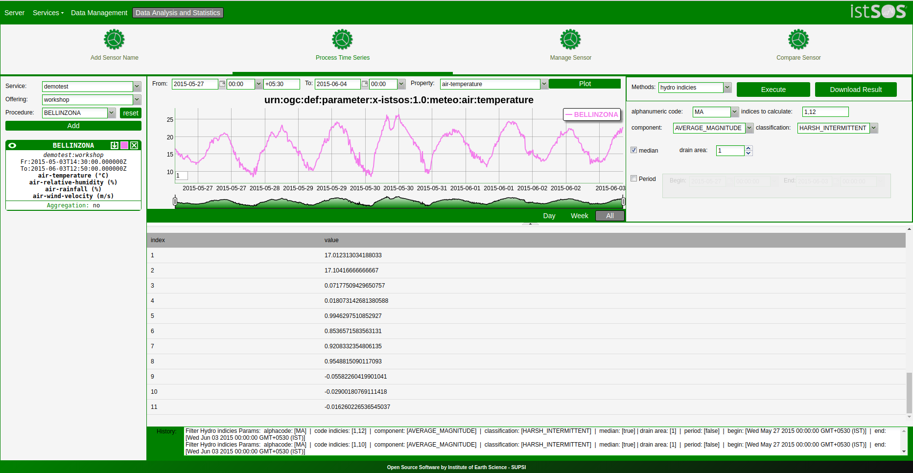
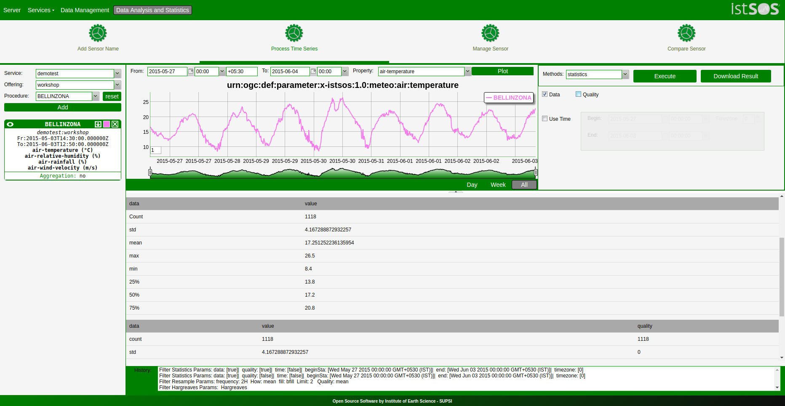
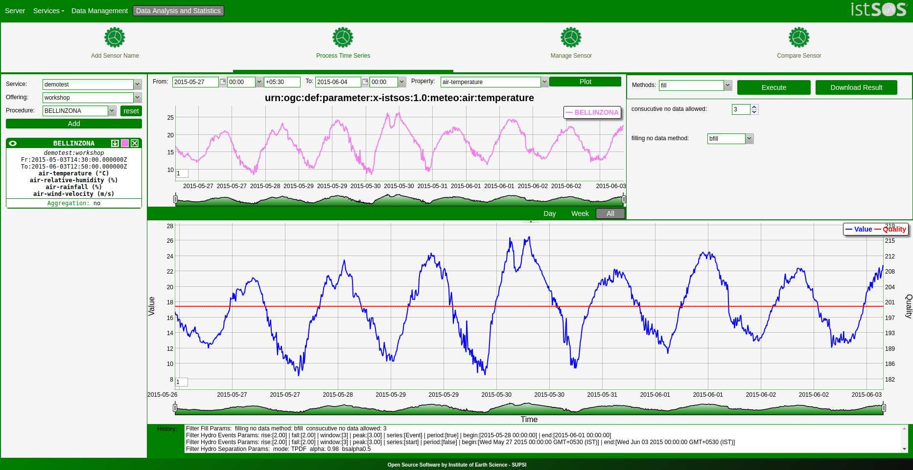
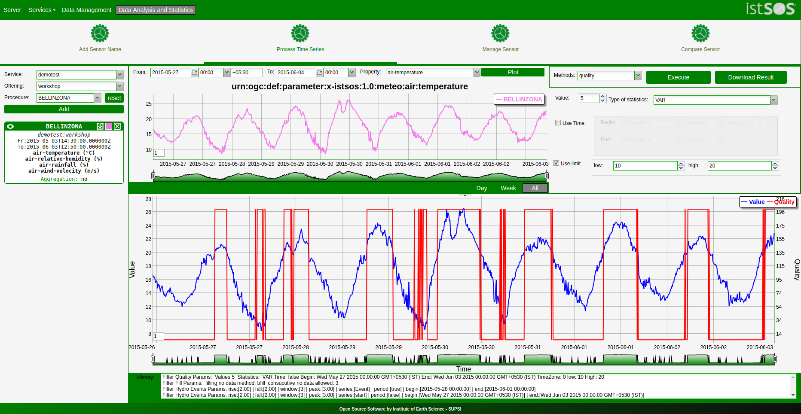
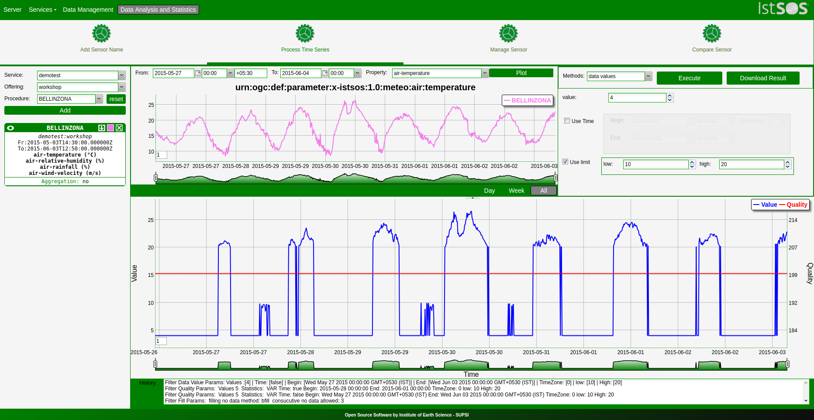

## istSOS-Data Analysis and statistical tool suite 

This section comprises of following parts:
* OAT installation
* Implemented OAT methods

OAT is a Python package which is integrated in the FREEWAT environment through an interface exposing its features to modellers and non programmer users. OAT library implements two main classes: the Sensor class that is designated to handle time­series data and metadata and the Method class which is designated to represent a processing method. The library applies the behavioral visitor pattern which allows the separation of an algorithm from the object on which it operates: thanks to this design pattern it is possible to add a new processing capability by simply extending the Method class without the need to modify the Sensor class. 

From a dependency point of view, OAT takes advantage of the PANDAS (McKinney, 2010), NUMPY and SCIPY (Van der Walt et. al. 2011) packages.

Following implemented OAT methods in istSOS web-api:

### 1. Resample method 
The resample method calculates a new time-series with a given frequency by sampling values of a time-series with a different frequency.

It uses the following parameters:
* **Frequency**: An alphanumeric code specifying the desired frequency (A=year, M=month, W=week, D=day, H=hour, T=minute, S=second; e.g.: 1H10T) (string) 
* **Sampling method**: the sampling method (string)
* **FIll**: If not null it defines the method for filling no-data (string)
* **Limit**: if not null it defines the maximum numbers of allowed consecutive no-data valuas to be filled (integer)
* **How quality**: the sampling method for observation quality index (string)

### 2. Exceedance filter method 
The Exceedance probability method calculates the exceedance probability after Searcy (1959) for a particular Sensor

It uses the following parameters:
* **Exceedance time unit**: the time unit in which the exceedance frequency will be displayed (string)
* **Under**: change the calculation to specify when values are not ecceeded (bool)
* **Exceedance values**: A discharge value for which the exceedance probability will be calculated (list of float)
* **Exceedance probability**: The discharge values that correspond to a given exceedance probability (list of float)

### 3. Integrate method 
Several methods are available for integrating a Sensors time-series with respect to time.

It uses the following parameters:
* **Time units**: The time units of data employed by the time-series (string)
* **Use time**: A list of tuples with upper and lower time limits for volumes computation (date, date)
* **Factor**:  a factor by which integrated volumes or masses are multiplied before storage generally used for unit conversion (flaot)
* **how**: Used to specify the hydrologic regime as defined in Olden and Poff (2003) (string)
* **Dates as text**: defines if dates have to be returned as text (True) or Timestamp (False) (bool)

### 4. Hydrograph separation method 
The hydrograph separation method is a filter which produces two time-series, storm-flow and baseflow hydrograph, from stream discharge. Either the Two Parameter Digital Filter (Eckhardt, 2005) or Single Parameter Digital Filter (Nathan & McMahon, 1990) may be used.

It uses the following parameters:
* **Mode**: Select bewteen TPDF and SPDF (string)
* **Alpha**: rate of decay of baseflow relative to current flow rate (recommended value 0.92 - 0.98) (float)
* **Bfl_max**: Long-term ratio of baseflow to total streamflow (requiredin case of TPDF) (float)

### 5. Extract hydro events method 
The extract hydrologic events method can be used to extract hydrographs for a time period (in days) preceding and following a peak hydrologic event, such as a storm. The minimum peak value is to be defined, as well as the miniumum time between peaks. The method will produce a new time-series for every event with the name of time-series assigned

It uses the following parameters:
* **Days prior the peak*: The number of days prior the peak to include in the event hydrograph (float)
* **Days following the peak*: The number of days following the peak to include in the event hydrograph (float)
* **Min days between peak*: Minimum time between successive peak, in days (float)
* **Exceedance probability*: suffix to be given to the created time-series; they will be named seriesName + suffix + number (string)
* **time*: a tuple of two elements indicating the Begin and End of datetimes records to be sed in peak extraction (date, date)

### 6. Hydrologic indices method 
The hydrologic indeces are a series of statistical measures of streamflow used to describe various ecologically important aspects of flow regime. Over 160 different hydrologic indeces can be calculated. For a complete discription of the available hydrologic indices, as well as the strings required to activate them, see the appendix in Olden & Poff (2003), Table 3-2 inWestenbroek et al (2012) or Henrickson (2006).

It uses the following parameters:
* **Alphanumeric code**: one of the predefined values (string)
* **Indices to calculate**: Code that jointly with htype determines the indiced to calculate (list of integer)
* **Component**: Used to specify the hydrologic regime as defined in Olden and Poff (2003) (string)
* **Classification**: Used to specify the hydrologic regime as defined in Olden and Poff (2003) (string)
* **Median**: Requests that indices that normally report the mean of some other summary static to insteadreport the median value (bool)
* **Drain area**: The gauge area in m2 (float)
* **Period**: a tuple of two elements indicating the Begin and End of datetimes records to be used (date, date)

### 7. Calculate statistics method 
The calculate statistics method returns some basic satistics for the Sensor time-series. The statistics can be performed for a selected time period and on the data values as well as their associated quality values.

The statistics calculated are:

* **count**: returns the number of data values in the series;
* **std**: the standard deviation of the series;
* **min**: the minimum value in the series;
* **max**: the maximum value in the series;
* **50%**: the median value in the series;
* **25%**: the first quartile value in the series;
* **75%**: the third quartile value in the series;
* **mean**: the mean of the series.

It uses the following parameters:
* **Data**: A flag to determinewether to compute statistics of data (bool)
* **Quality**: A flag to determine wether to compute statistics of quality (string)
* **Use time**: used when setting upper and lower time limits for statistic calculation. The bounds are closed bounds (t0 >= t <= t1) (date, date)

### 8. FIll filter method 
If a Sensor is missing data in the form of gaps, or if it contains no-data values, it can be filled using a variety of methods:

It uses the following parameters:
* **bfill**: backward fill (fills all the missing data values with the last data value before the no-data gap)
* **ffill**: forward fill (fills all the missing data values with the next data value after the no-data gap)

### 9. Set quality method 
The set quality method can be used to set uniform quality values for a Sensor within time bounds, or to remove values that fall outside of specified value bounds.

It uses the following parameters:
* **Value**: The value to be assigned (float)
* **Type of statistics**: The type of statistics the weight is estimated from (string)
* **Use time**: A flag to determine upper (Begin position) and lower (End position) time limits for assignment (bool)
* **Use limit**: A flag to determine upper and lower value limits for weigth assignment. The bounds are closed bounds (min >= x <= max) e.g: [(None,0.2),(0.5,1.5),(11,None)] will apply: if data is lower then 0.2 –> (None,0.2) or data is between 0.5 and 1.5 –> (0.5,1.5) or data is higher then 11 –> (11,None)

### 10. Data values method 
The data values method can be used to set uniform data values for a Sensor within time bounds, or to remove values that fall outside of specified value bounds.

It uses the following parameters:
* **Value**: the value to be assigned (float)
* **Use time**: a flag to determine upper (Begin position) and lower (End position) time limits for assignment (bool)
* **Use limit**: a flag to determine upper and lower value limits for assignment. The bounds are closed bounds (min >= x <= max) e.g: [(None,0.2),(0.5,1.5),(11,None)] will apply: if data is lower then 0.2; –> (None,0.2); or data is between 0.5 and 1.5 –> (0.5,1.5); or data is higher then 11 –> (11,None)

### 11. Hargreaves method 
The Hargreaves-Somani equation can be used to estimate the reference crop evapotransipration using minimum climatological data. In OAT the daily reference evapotransipration can be calculated from a given Sensor with a resolution smaller than 1 day, by clicking the “Execute” button. The parameters needed by the Hargreaves equation are automatically extracted and a new time series is produced with daily evapotransiration values..

### Methods
